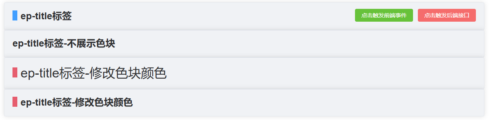

# `c7-title` 标题(工具类)

> 标题工具类




### 基础用法

```vue
<c7-title label="ep-title标签">
      <c7-button type="success" @click="alertMsg('点击事件')" click-event label="点击触发前端事件"></c7-button>
      <c7-button type="danger" url="/api/button/click" :datas="buttonClickRef" label="点击触发后端接口"></c7-button>
    </c7-title>
```

### 不展示色块

```vue
<c7-title label="ep-title标签-不展示色块" :is-show-color-block="false">

    </c7-title>
```

### 修改色块颜色

```vue
<c7-title label="ep-title标签-修改色块颜色" color-block-color="#E65D6E" text-size="h1" :is-bold="false">

    </c7-title>
```

### 修改标题的大小

```vue
<c7-title label="ep-title标签-修改色块颜色" color-block-color="#E65D6E" text-size="h2" >

    </c7-title>
```

### Attributes

| 参数 | 说明 | 类型 | 是否必填|  可选值 | 默认值
| --- | --- | --- | ---| --- |  --- |
|  label| 标题名称  |String |是 |    |
| backgroundColor | 背景色  | String  | 否 | | `#f0f2f5`
| isShowColorBlock | 是否展示色块 | Boolean | 否 | true/false | true
|colorBlockColor | 色块颜色| String| 否| 颜色色号| `#409eff`
| textSize | 文本大小 | String | 否| h1、h2、h3、h4、h5 | h2
| isBold |字体是否加粗 | Boolean | 否  | true/false | true

### Slots

| name | 说明
| --- | ---
| default | 标题右侧区域

